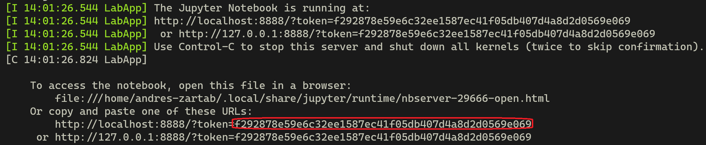

# Deploying a Deep Learning model (Markdown taken from Coursera MLops) 
 
# Docker
 
 
[Docker](https://www.docker.com/) is a tool that allows you to ship your software along with all the dependencies that it needs to run. You can download the free version [here](https://www.docker.com/products/docker-desktop). 

Installing Docker is straightforward for Linux and Mac users but might be more challenging for Windows users. If you use Windows we recommend you stick with the first method to run this ungraded lab. However if you want to go through with this method you will need to install [Docker Desktop](https://docs.docker.com/docker-for-windows/install/) and [WSL2](https://docs.microsoft.com/en-us/windows/wsl/install-win10) (Windows Subsystem for Linux 2). By doing this you will enable a real Linux kernel inside your Windows OS and will get full usage out of Docker. For a better experience we also recommend to install the [Windows Terminal](https://www.microsoft.com/en-us/p/windows-terminal/9n0dx20hk701). This is a great setup to do machine learning related work on Windows but it requires a lot more setup.
 
### 1. Pulling the image from Docker hub

Images are an important concept within the Docker ecosystem. You can think of them as the compilation of all the elements (libraries, files, etc) needed for your software to run. 

Using the following command will download or pull the image necessary to run this ungraded lab locally:
```bash
docker pull deeplearningai/mlepc1w1-ugl:jupyternb
```

 
### 2. Running a container out of the image:

Images can also be thought of as the blueprints for containers, which are the actual instances of the software running. To run a container using the image you just pulled, double check that you are currently on the `week1-ungraded-lab` directory and use this command:
```bash
docker run -it --rm -p 8888:8888 -p 8000:8000 --mount type=bind,source=$(pwd),target=/home/jovyan/work deeplearningai/mlepc1w1-ugl:jupyternb
```
 
Let's break down this command and its flags:
 
- -it: Runs the container in an interactive mode and attaches a pseudo-terminal to it so you can check what is being printed in the standard streams of the container. This is very important since you will have to **copy and paste the access token for Jupyter lab**.

- --rm: Deletes the container after stopping it.
- -p: Allows you to map a port in your computer to a port in the container. In this case we need a port for the Jupyter server and another for the server you will run within the ungraded lab.
- --mount: Allows you to mount a directory in your local filesystem within the container. This is very important because if no mounts are present, changes to files will not persist after the container is deleted. In this case we are mounting the current directory `week1-ungraded-lab` onto the `/home/jovyan/work` directory inside the container.
 
When the container starts running you will see some information being printed in the terminal. Usually you will need to authenticate to use Jupyter lab, for this copy the token that appears on your terminal, head over to [http://localhost:8888/](http://localhost:8888/) and paste it there.

Your terminal's output should look very similar to the next image, in which the token has been highlighted for reference:



 
Once you have authenticated, click in the `/work` directory and you should see all of the files from your current local directory. Look for the `server.ipynb` file and open it to begin the ungraded lab.

To stop the container once you are done with the lab just press `Ctrl + C` twice. This will also delete the container.
 
### And... that's it! Have fun deploying a Deep Learning model! :)
